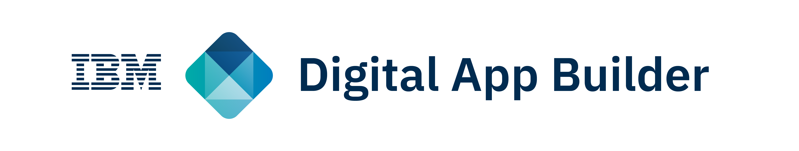
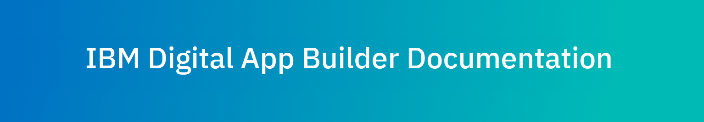

Thank you for your interest in the **IBM Digital App Builder**.

By downloading IBM Digital App Builder, you confirm that (1) you have had the opportunity to review the License Information document [here](https://www-03.ibm.com/software/sla/sladb.nsf/sla/home?OpenDocument) for **IBM Digital App Builder v8.0** and (2) you agree to its License Information.

You should not download and use **IBM Digital App Builder** if you do not agree to its License Information.

# About IBM Digital App Builder

**IBM Digital App Builder** helps you to quickly create mobile, web and PWA (Progressive Web Apps) multi-channel applications with AI capabilities powered by Watson services. The apps created using the Digital App Builder leverage IBM Mobile Foundation V8 (on-prem or cloud) for security, backend connectivity, and analytics.

You can install the IBM Digital App Builder on Mac and Windows operating system.

For a complete **product documentation**, refer to:

.
