# About IBM Digital App Builder

**IBM Digital App Builder** helps you to quickly create a mobile application and deploy to Mobile Foundation on IBM Cloud. The Digital App Builder offers a low code/no code experience to build web and mobile applications with AI capabilities embedded through use of Watson services.

* **Tools** – helps you to quickly drag-and-drop design elements and build the application to address departmental needs of an enterprise.
* **Connectivity** – establishes the application connectivity to the databases and the development/deployment platform.
* **Integration** – helps you to integrate and consume Watson microservices and add AI capabilities like Watson Assistant or Visual recognition into your app.
* Test the application for various form factors before it is deployed.
* Configure the back-end configuration for the application from the Digital App Builder and push the changes to the server
* **Templates** – Use the quick start templates to build your application.

# Getting Started

IBM Digital App Builder consists of tools and IBM Cloud solutions for developers and administrators. This document is intended for application developers who are just starting to use the Digital App Builder to build their first mobile app.

## Installation of IBM Digital App Builder

You can install the Digital App Builder on Mac and Windows operating system.

### Pre-requisites:

IBM Digital App Builder requires the following software pre-installed:

* Npm
* Cordova
* Ionic
* IBM Cloud account with a Mobile Foundation Server instance.
* Xcode (To preview the app on iOS simulator)
* Android Studio (To preview the app on Android emulator)
* Chrome (To preview web platform)

### Installing IBM Digital App Builder on MacOS

1. Install **Node.js** and **npm** by downloading the setup from [https://nodejs.org/en/](https://nodejs.org/en/) (Node.js 8.x or above)

   ```java
    $node -v
    v8.10.0
    $npm -v
    6.4.1
    ```

2. Install **Cordova** and **ionic**

    ```java
    $ sudo npm install -g cordova && sudo npm install -g ionic
    $ cordova –version
    7.0.1
    $ ionic –version
    4.2.0
    ```

3. [Download](https://github.com/MobileFirst-Platform-Developer-Center/Digital-App-Builder/releases) the Digital App Builder installation file (**IBM.Digital.App.Builder-0.XX.0-mac.zip**, where XX is the build version) and extract the contents.
4. Double click the Digital App Builder executable to open the Digital App Builder.

    >**Note**: To preview the App on iOS, download and install **XCode** from Apple App Store.

### Installing IBM Digital App Builder on Windows

Run the following commands from the command prompt opened in administrative mode:

1. Install **Node.js** and **npm** by downloading the setup from [https://nodejs.org/en/](https://nodejs.org/en/) (Node.js 8.x or above)

    ```java
    C:\>node -v
    v8.10.0
    C:\>npm -v
    6.4.1
    ```

2. Install **Cordova** and **ionic**

    ```java
    C:\>npm install -g cordova
    C:\>cordova –v
    7.0.1
    ```

3. Install **ionic**

    ```java
    C:\>npm install -g ionic
    C:\> ionic –version
    4.2.0
    ``` 

4. [Download](https://github.com/MobileFirst-Platform-Developer-Center/Digital-App-Builder/releases) the Digital App Builder installation file (**IBM.Digital.App.Builder.Setup.0.XX.0.exe**, where XX is the build version).
5. Double click the Digital App Builder executable to install. A short cut also created in the **Start > Programs** in the desktop. The default installation folder is `<AppData>\Local\IBMDigitalAppBuilder\app-0.xx.0`.
6. Start creating apps using the Digital App Builder from the desktop shortcut or from the **Start > Programs** menu.

    >**Note**: 
    >To preview the App on Android,
    >* You will need to install Android Studio. Follow the instructions here - [https://developer.android.com/studio/](https://developer.android.com/studio/).
    >* Configure an Android Virtual Machine. Follow the instructions here - [https://developer.android.com/studio/releases/emulator](https://developer.android.com/studio/releases/emulator).


## Launching the IBM Digital App Builder

* In **Windows**, you can launch the Digital App Builder by selecting **Start > Programs > IBM Digital App Builder**.
* In **MacOS**, you can double click the **IBM Digital App Builder icon** to open to use the Digital App Builder.

>**Note**: 
>* **Accept** the **License to use the IBM Digital App Builder** in the flash screen to proceed to further.
  
IBM Digital App Builder launch screen consists of the following sections:

* **Getting Started**: Enables you to create a new app or open an existing app.
* **Recent**: This section is displays the recently created application.
* **Templates**: This section displays the available starter templates that will help you to quickly start building an application.
* **Latest Updates**: Displays the latest updates from MF platform

## Prerequisites Check

Before started to use the Digital App Builder, a prerequisites check will check and confirm if you have installed the required software for the Digital App Builder to run proper and take corrective action in case of any issues.

Perform a prerequisite check by selecting **Help > Prerequisites Check** before developing an application.

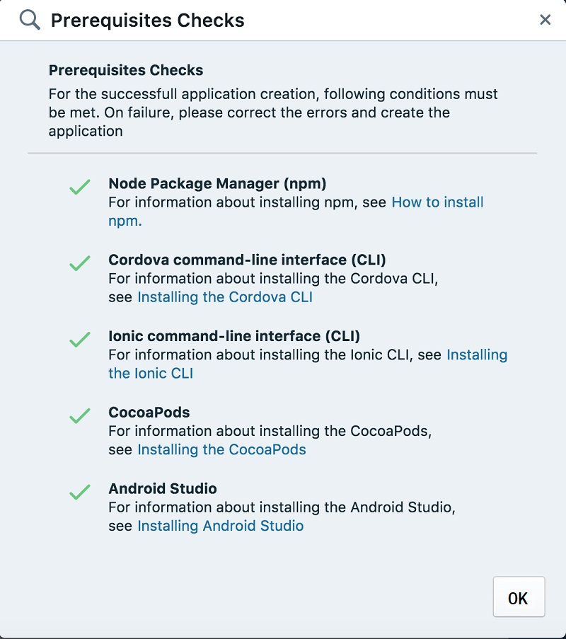

In case of any error, rectify the error and restart the Digital App Builder before creating the mobile application.

>**Note**: CocoaPods are required for MacOS only.

# Creating a Mobile App

You can create a new Mobile Application by clicking **Create new app** icon from the Digital App Builder dashboard.

1. Click **Create new app** icon. This displays the **Select Channel** window.

    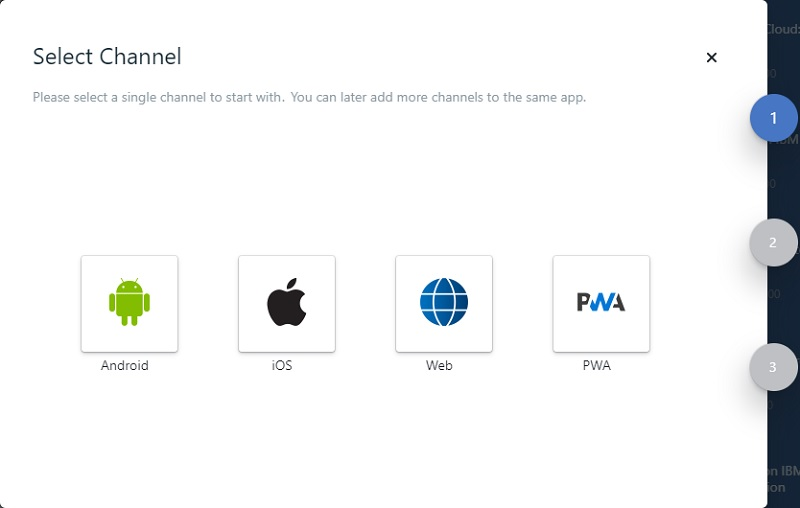

2. Select the channel for which you want to develop and deploy the application, by double clicking the respective icon. The **Select type of server to connect to** window is displayed.

    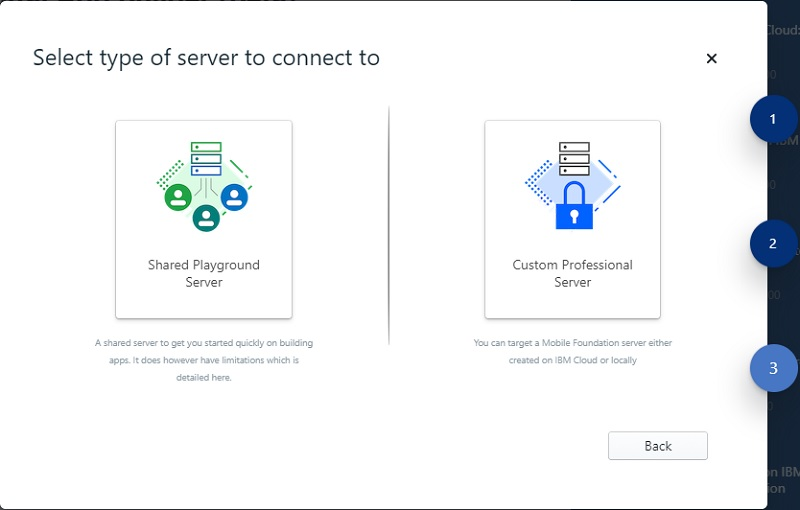

3. You can select a **Shared Playground Server** or a **Custom Professional Server**.
    * **Shared Playground Server** – a shared server to get you started quickly to build an application. On selecting the Shared Playground Server displays the **Configure IBM Cloud instance** screen.

        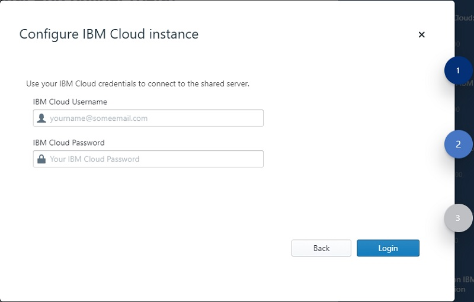

        Enter the IBM Cloud access details (**IBM Cloud Username**, and **IBM Cloud Password**). 

        Click **Login** to connect to the server. On successful login displays the **Create App** window where you can select a shared server and enter the details of the new application. Enter the details of the new application: **Name** of the appliation, **Location**, **Project/Bundle Id**, and **Version** of the application. 
 
        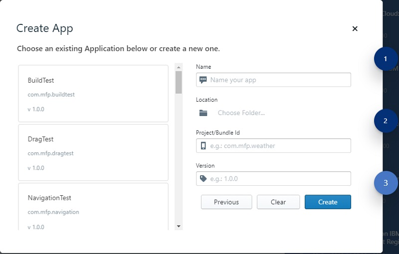

        Click **Create** to create a new application.

    * **Custom Professional Server** – You can connect to a custom server either created on IBM Cloud or locally. The **Configure IBM Cloud instance** window is displayed wherein you can either select an existing server or click to **Create New Server** link.

        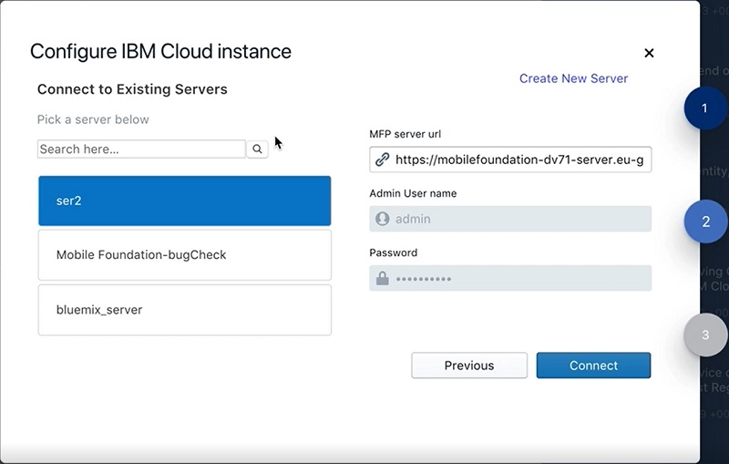
 
4. The **Configure IBM Cloud instance** window displays the list of Mobile Foundation server instances, if any exists, in your IBM Cloud account. You can also search for a server in your cloud instance and select. On selection, the **Server Name**, **MFP Server url**, **Admin User Name**, **Password**, is displayed. If no server exists, you can **Create New Server** instance by clicking the **Create New Server** link. This will display the new **Configure IBM Cloud instance** window.

    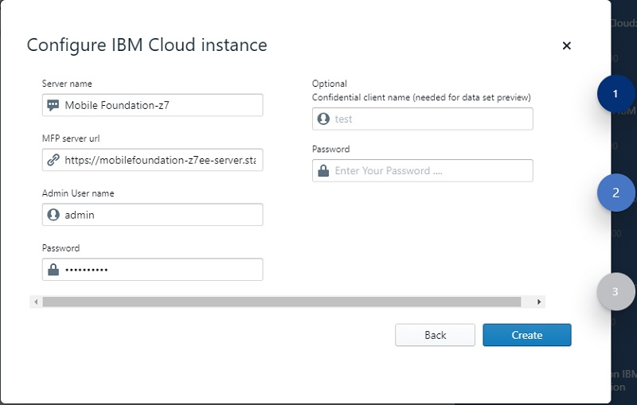

5. Enter the new IBM Cloud instance details, like **Server name**, **Mobile Foundation server url**, **Admin User name**, **Password**, **Confidential client name** (optional) information, and **Password**.
 
    >**Note**: You can get the server url and login credentials from the Mobile Foundation server dashboard for the selected server instance.
    
6. Click **Create** to create a new mobile application. This displays the **Create App** window.

    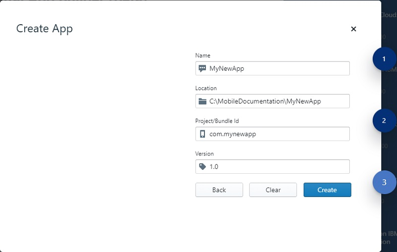
 
7. Enter the application **Name**, **Location** where the project files will be stored, **Project/Bundle Id**, and the **Version** of the application.
8. Click **Create** to create the application. This displays the **Project Explorer** window. This is your workspace for creating a new application.

    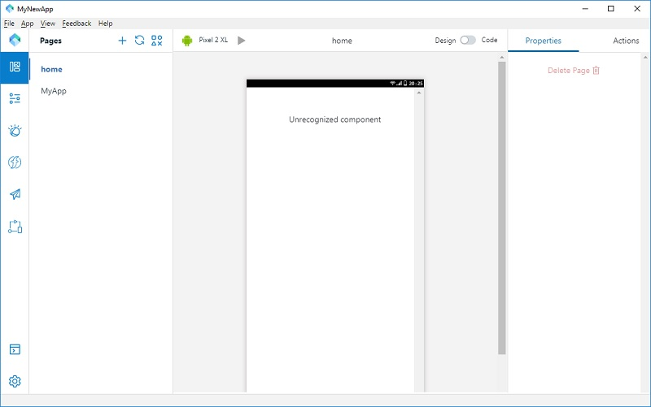
 

# Developing an Application

## About Project Explorer

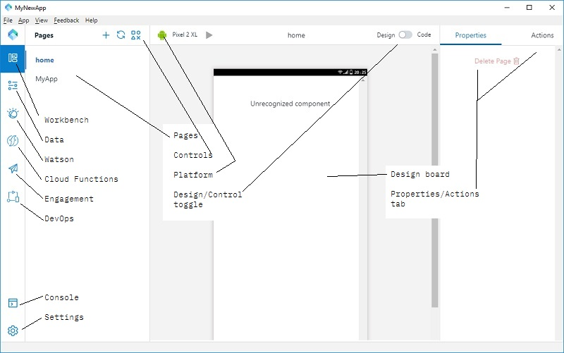 

Project Explorer consists of the following section:

* **Activity Bar** – Consists of links to **Workbench**, **Data**, **Watson**, **Cloud Functions**, **Engagement**, **DevOps**, **Page**, **Refresh**, and **Controls**.
    * **Page** consists of the pages of the application.
    * **Controls** consists of **Basic** (**Button**, **Heading Text**, **Image**, and **Label**), **Data**, **Login**, **AI** (Watson Chat, Watson VR), and **Community** (Google OCR).

        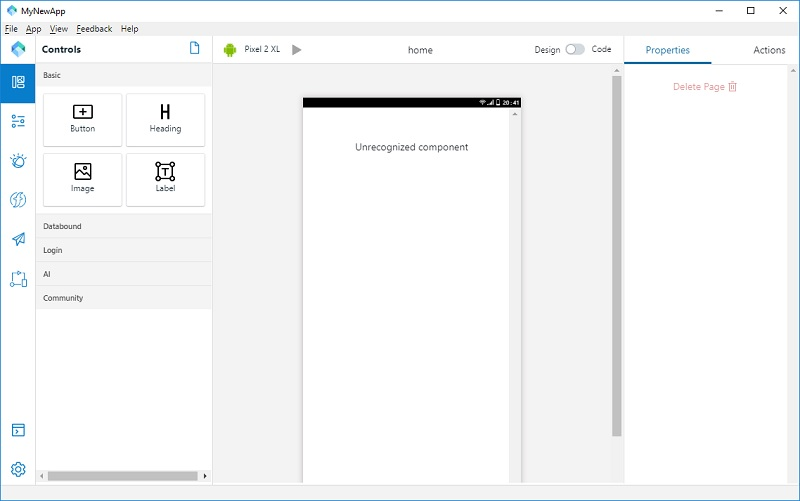 

        * You can use the **Basic** components by drag-and-drop to the design board. On selecting the component in the design board, the properties of the component are displayed on the properties section and you can also assign an action for the component in the **Actions** tab.
        * Selecting **Databound** in the Controls helps you to connect with the data set by defining the Databound properties defined in your Mobile Foundation server instance.

            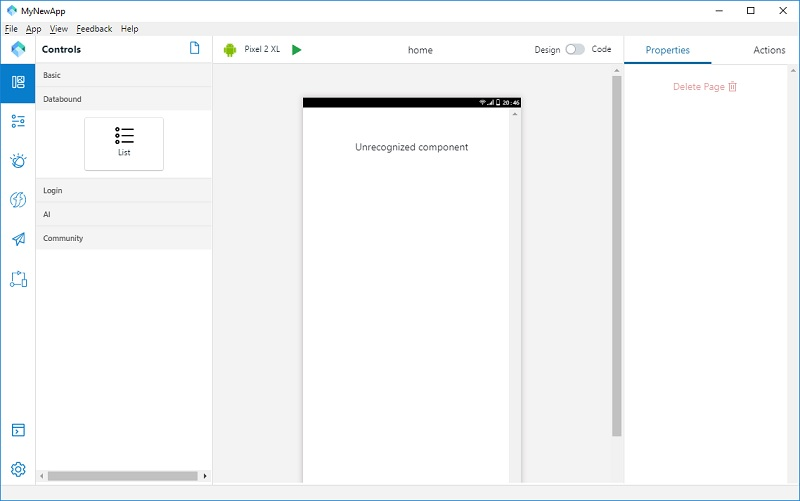

        * Selecting **Login** will help you to create the Login properties. Select the **ChallengeHandler** to the drawing board to define the login properties.

            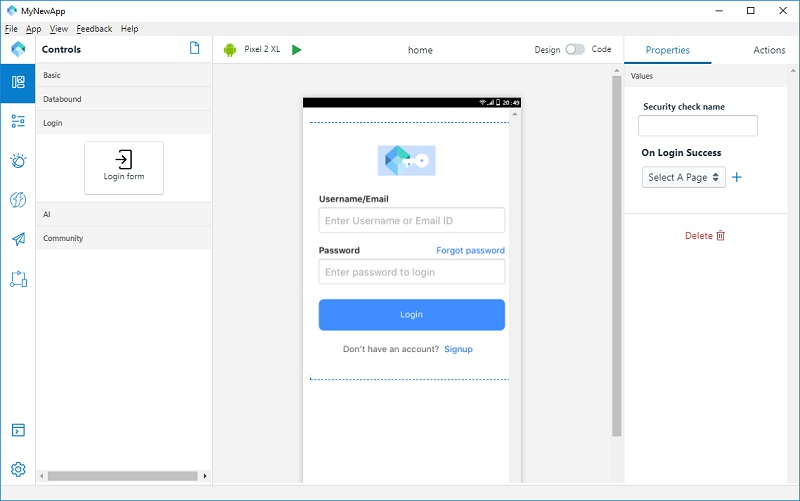

        * Select **AI** to display the Watson services subscribed that can be added to your application.

            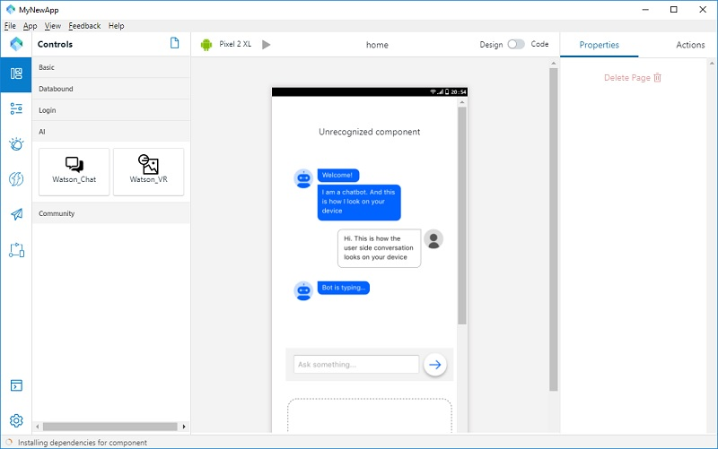

        * Selecting **Community** will display the **Google_OCR** component.

    * **Project Editor**: displays the project files location and files can be viewed in code.

        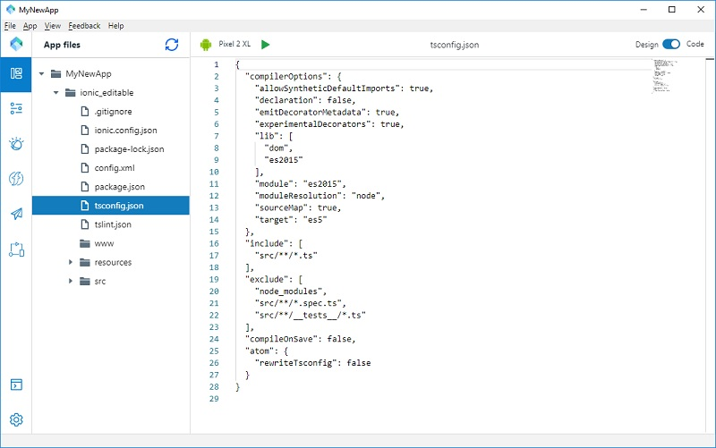 

    * **Console**: displays the console to see the code for each component.
    * **Settings**: displays the project details.

        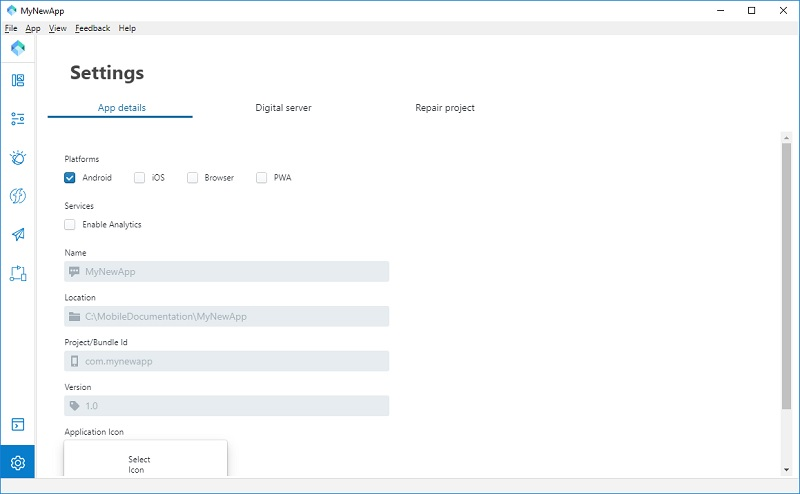

        You can make modifications to the app settings. You can select additional platform, adding **Application Icon** in the **App details** tab. 

        In the **Digital server** tab, you can modify the server details, if required. 

        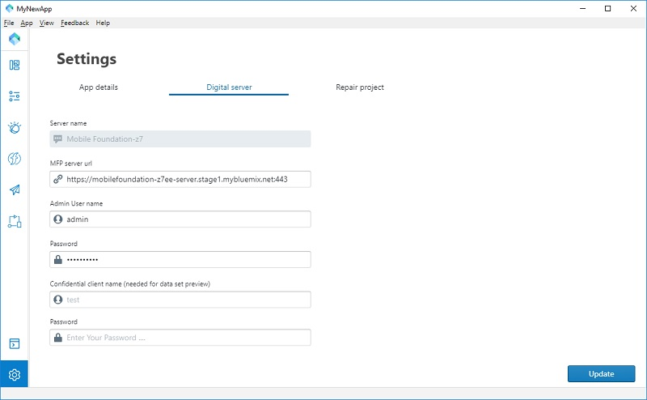

        **Repair project** tab enables you to rebuild the app.

        


* **Design Board** – At the centre of the project explorer is the design board which displays the either the design or the code and the channel for which the app creation is planned.
* **Properties** – At the right-hand side is the properties and action toolbar. When a control is placed in the design board, you can edit and modify the properties of the control and connect a control with a related action to perform.

# Using Data Designer

## Dataset Creation

Creating a Data set for a micro service involves the following steps. After creating the data set, you can connect the data bound controls in your app.

### Creating a new data set

1. From the landing page of the Digital App Builder, open any existing App or create one.
2. Click **Data** tab.
3. Create a data set. You can either create from an existing source (default) or create a data source for a microservice using an OpenAPI doc.
    * Create from existing data source (default) - This will populate the dropdown with all the Data sources(adapters) from the configured Mobile Foundation server.
    * Create Data source for a microservice using OpenAPI doc - This option lets you create a Data Source from an Open API specification document (Swagger json/yml) file, and a Data Set from it.

**Create a Data set from an existing Data Source**

1. Select the Datasource for which you want to create the Dataset.
2. This will populate the available entities in the Data Source. Select the entity to be created.
3. Give a name to the dataset and click on **Add** button.
4. This will add the Dataset and you will be able to see the Attributes and Actions associated with that dataset.
5. You can Hide some of the attributes and Actions based on what you want to do with the data set.
6. You can also edit the **Display Labels** for the attributes
7. You can also Test any of the GET Actions by providing the required attributes and clicking on the **Run this action** which is part of the Action. Remember for this to work you should have specified the Confidential client name and password in the settings tab.

**Create a Data source for a Microservice using a swagger file**

1. Select the **json/yml** file for which you want to create a datasource for and click **Generate**.
2. This will generate an Adapter, which is a configuration artifact on the MF server that you can re-use and deploy it to the Mobile Foundation server.
3. Select the entity for which you want to define the data source for.
4. Give a name to the dataset and click on **Add** button.
5. This will add the Dataset and you will be able to see the Attributes and Actions associated with that dataset.

**Binding the data set you created to a data bound control and add it to your app**

1. Create a page.
2. Create a List which is bound to a Dataset.
3. You can find Basic List control under Databound controls.
4. Drag and drop the Basic List control on to the canvas.
5. Select the **Dataset** which you just created to associate with the List control.
6. Select the Actions and Attributes that you want to associate with item list / Create/ Update/ Delete.
Now your component is associated with the dataset. This will allow your app to list, edit, create and delete the entities from the backend microservice.
7. Run the preview in Android/iOS and web.

# Authentication

The Login control helps you to create a login page for your application to connect the user to the Mobile Foundation server. Make the following configuration on the server side and then to the application in the Digital App Builder.

1. Make the following changes on Mobile Foundation Server
    * Deploy a security check adapter which would take username and password as input.
    * In the mfpconsole, go to app's security tab and under Mandatory Application Scope, add the above created security definition as scope element.
2.	Make the following configuration in your Application using the Digital App Builder.
    * Add **Login** form to canvas.
    * In **Properties** tab, input the security check name and the page to navigate on login success.
    * Run the app.

# About Watson Services

You can connect to any of the Watson Services subscribed by you, like Watson Chat, Watson VR etc. You can use the Watson services to create a new model visual recognition or modify an existing one. 

To add a Watson service to your application:
1. From the Digital App Builder, click **Controls**. Navigate and click **AI** tab. This will display the Watson_Chat and Watson_VR.
2. Drag and drop the required Watson service to the drawing board.
3. Modify the properties and action for the Watson component.

# Using Code Editor

Code editor helps you to edit the code and enable to view and debug any errors.

In the Design Board, switch from **Design to Code**, to view the code of the specific file in the project editor.

1. Switching the **Design to Code** will display the following popup screen:

    
 
2. Click **Create** will create a copy of your application in an editable form. Any changes made in your app will not be reflected in the original application.
3. This will display the project explorer with all the project files for the application.

# Preview using Digital App Builder

You can preview the application developed by connecting to the simulation to the channel selected.

* To preview the App on iOS, download and install **XCode** from Apple App Store.
* To preview the App on Android, 
    * Install Android Studio and follow the instruction. [https://developer.android.com/studio/](https://developer.android.com/studio/)
    * Configure an Android Virtual Machine. Follow the instructions [here](https://developer.android.com/studio/releases/emulator).

# Deploying an Application

After previewing your application and if it is ready for deploying, after rectifying any errors, perform the following steps for deploying the application:

**For Android application:**

1. Navigate to the directory, which you have specified at the time of creating the application.
2. Go to ionic folder.
3. Go to **Platform > Android**.
4. Open Android Studio and then go to **File > Open Project** > Choose the android folder mentioned in step 3.
5. Build the project. 
    >**Note**: For publishing and building follow the steps from tutorial https://developer.android.com/studio/publish/.

**For iOS application**:

1. Navigate to the directory, which you have specified at the time of creating the application.
2. Go to ionic folder.
3. Go to Platform > iOS.
4. Open **Xcode** and then build the project. 
    >**Note**: For publishing and building follow the steps from tutorial https://developer.apple.com/ios/submit/.

# Debugging known issues

# FAQ
