# IBM Digital App Builder

Thank you for your interest in the **IBM Digital App Builder (beta)**.

By downloading IBM Digital App Builder (beta), you agree and confirm that (1) you have had the opportunity to review the agreement and (2) you agree to be bound by its terms, (3) you accepted the license agreement by visiting [here](https://epwt-www.mybluemix.net/software/support/trial/cst/programwebsite.wss?siteId=505&tabId=939&w=dakw9d8&p=5571ss17).

**Disclaimer**

IBM's statements regarding its plans, directions and intent are subject to change or withdrawal without notice at IBM's sole discretion. Information regarding potential future products is intended to outline our general product direction and it should not be relied on in making a purchasing decision. The information mentioned regarding potential future products is not a commitment, promise, or legal obligation to deliver any material, code or functionality. Information about potential future products may not be incorporated into any contract. The development, release, and timing of any future features or functionality described for our products remains at our sole discretion.

<hr>

[](https://github.com/MobileFirst-Platform-Developer-Center/Digital-App-Builder/releases) 


<hr>

# Contents

* [About IBM Digital App Builder](#about-ibm-digital-app-builder)
* [Getting Started](#getting-started)
    * [Installation of IBM Digital App Builder](#installation-of-ibm-digital-app-builder)
        * [Installing on MacOS](#installing-on-macos)
        * [Installing on Windows](#installing-on-windows)
    * [Launching the Builder](#launching-the-builder)
    * [Prerequisites Check](#prerequisites-check)
* [Creating an App](#creating-an-app)
* [Developing an Application](#developing-an-application)
    * [About the Explorer](#about-the-explorer)
* [Controls](#controls)
    * [Basic controls](#basic-controls) 
        * [Button](#button)
        * [Heading Text](#heading-text) 
        * [Image](#image) 
        * [Label](#label) 
    * [Databound](#databound)
        * [Basic List](#basic-list)
    * [Login](#login)
        * [Login Form](#login-form)
    * [AI](#ai)
        * [Watson Chat](#watson-chat)
        * [Watson VR](#watson-vr)
* [Using Data Viewer](#using-data-viewer)
    * [Dataset Creation](#dataset-creation)
* [Integrating with Watson Services](#integrating-with-watson-services)
    * [Chatbot](#chatbot)
    * [Image Recognition](#image-recognition)
* [Using Code Editor](#using-code-editor)
* [Preview using the Builder](#preview-using-the-builder)
* [Deploying an Application](#deploying-an-application)
* [Troubleshooting](#troubleshooting)
* [FAQ](#faq)

# About IBM Digital App Builder

**IBM Digital App Builder** (called "Builder" for short) helps you to quickly create mobile, web, and PWA (Progressing Web Apps) multi-channel applications with AI capabilities powered by Watson services. The apps created using the Builder leverage IBM Mobile Foundation (Mobile Foundation service on IBM Cloud, or Mobile Foundation v8 on ICP) for security, backend connectivity, operational metrics and crash analytics.

The Builder offers a drag-and-drop experience to build the applications with no specialized software development skills. The application created use open source technologies like cordova, ionic, and angular.

* **Tools** – helps you to quickly drag-and-drop app controls and build the application.
* **Integration** – helps you to create datasets for your microservices backends.
* **Preview** - preview the application for various form factors before it is deployed.
* **Analytics** - see crash analytics, page flow analytics, and operational analytics for all the channels of your application.
* **Templates** – Use the quick start templates to build your application.


# Getting Started

Install and configure the Builder for first time use.

## Installation of IBM Digital App Builder

You can install the Builder on Mac and Windows operating system.

### Pre-requisites:

IBM Digital App Builder requires the following software pre-installed:

* Npm
* Cordova
* Ionic
* IBM Cloud account with a Mobile Foundation Server instance.
* Xcode (To preview the app on iOS simulator)
* Android Studio (To preview the app on Android emulator)
* Chrome (To preview web platform)

### Installing on MacOS


1. Download the .dmg (**IBM.Digital.App.Builder-n.nn.n.dmg**) from [here](https://github.com/MobileFirst-Platform-Developer-Center/Digital-App-Builder/releases).

2. Double click on it to mount the installer.

3. Move the IBM Digital App Builder to the **Applications** folder.

4. Install **Node.js** and **npm** by downloading the setup from [https://nodejs.org/en/](https://nodejs.org/en/) (Node.js 8.x or above)

    ```java
    $node -v
    v8.10.0
    $npm -v
    6.4.1
    ```
5. Install **Cordova** and **ionic**

    ```java
    $ sudo npm install -g cordova && sudo npm install -g ionic
    $ cordova –version
    7.0.1
    $ ionic –version
    4.2.0
    ```
>**Note**: For MacOS, download and install **XCode** from Apple App Store to preview the application.

### Installing on Windows

Run the following commands from the command prompt opened in administrative mode:

1. Install **Node.js** and **npm** by downloading the setup from [https://nodejs.org/en/](https://nodejs.org/en/) (Node.js 8.x or above)

    ```java
    C:\>node -v
    v8.10.0
    C:\>npm -v
    6.4.1
    ```

2. Install **Cordova**

    ```java
    C:\>npm install -g cordova
    C:\>cordova –v
    7.0.1
    ```

3. Install **ionic**

    ```java
    C:\>npm install -g ionic
    C:\> ionic –version
    4.2.0
    ``` 

4. [Download](https://github.com/MobileFirst-Platform-Developer-Center/Digital-App-Builder/releases) the Builder installation file (**IBM.Digital.App.Builder.Setup.n.nn.n.exe**).
5. Double click the Builder executable to install. A short cut is also created in the **Start > Programs** in the desktop. The default installation folder is `<AppData>\Local\IBMDigitalAppBuilder\app-n.nn.n`.
6. Start creating apps using the Builder from the desktop shortcut or from the **Start > Programs** menu.

    >**Note**: 
    >To preview the App on Android,
    >* You will need to install Android Studio. Follow the instructions here - [https://developer.android.com/studio/](https://developer.android.com/studio/).
    >* Configure an Android Virtual Machine. Follow the instructions here - [https://developer.android.com/studio/releases/emulator](https://developer.android.com/studio/releases/emulator).

## Launching the Builder

* In **Windows**, you can launch the Builder by selecting **Start > Programs > IBM Digital App Builder**.
* In **MacOS**, you can double click the **IBM Digital App Builder icon** to open the Builder.

>**Note**: 
>* **Accept** the **License to use the IBM Digital App Builder** in the flash screen to proceed to further.
  
## Prerequisites Check

Perform a prerequisite check by selecting **Help > Prerequisites Check** before developing an application.


In case of any error, rectify the error and restart the Builder before creating an application.

>**Note**: CocoaPods are required for MacOS only.


# Creating an App

You can create a new Application by clicking **Create new app** icon from the Builder dashboard.

1. Click **Create new app** icon. This displays the **Select Channel** window.

    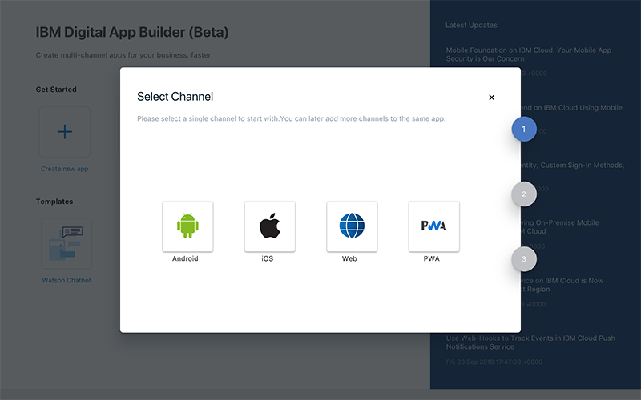

2. Select the channel for which you want to develop and deploy the application, by clicking the respective icon. You can add additional channels later.

    >**Note**: You can build and run the iOS apps only on MacOS.

3.  The **Select type of server to connect to** window is displayed.

    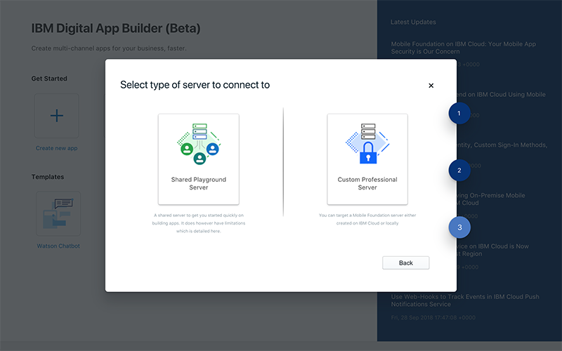

4. You can select a **Shared Playground Server** or a **Custom Professional Server**.
    * **Shared Playground Server** – a shared Mobile Foundation server hosted on IBM Cloud to get you started quickly.

        >**Warning**: The Shared Playground Server is a common server that is shared between many developers. This server should not be used for production apps. The data in this server can be deleted without notice. The server uptime is not guaranteed.

        

        Enter the **IBM Cloud API Key**. For more details access details refer to **How to create a Platform API Keys** in the [FAQ](#faq) section. 

        Click **Login** to connect to the server. 

    * **Custom Professional Server** – You can connect to your own Mobile Foundation server either created on IBM Cloud or local. In the **Configure IBM Cloud instance** window you can either select an existing server or create a new server.

        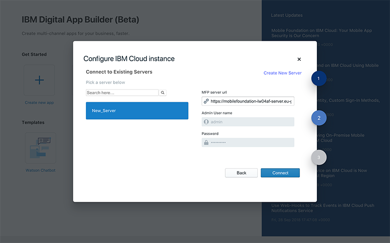
 
    The **Configure IBM Cloud instance** window displays the list of Mobile Foundation server instances you have defined previously. On selecting the server, the **Server Name**, **Mobile Foundation server url**, **Admin User Name**, **Password**, is displayed. To define a new server, you can click **Create New Server** link. This will display the new **Configure IBM Cloud instance** window.

    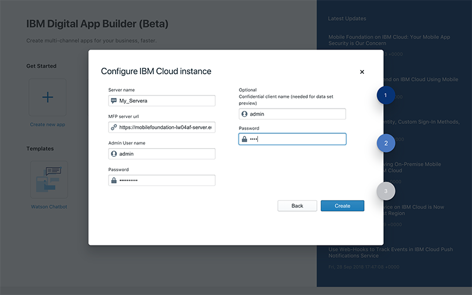

    Enter the new IBM Cloud instance details, like **Server name**, **Mobile Foundation server url**, **Admin User name**, **Password**. Optionally, you need to provide a **Confidential client name** and **Password**, for previewing the data in the Data viewer.
 
    >**Note**: You can get the server url and login credentials from the Mobile Foundation server dashboard for the selected server instance.
    
5. On successful login displays the **Create App** window where you can select an existing app definition that you may have created or create a new one by entering the details. For a new app provide: **Name** of the application, **Location**, **Project/Bundle Id**, and **Version** of the application. 
 
    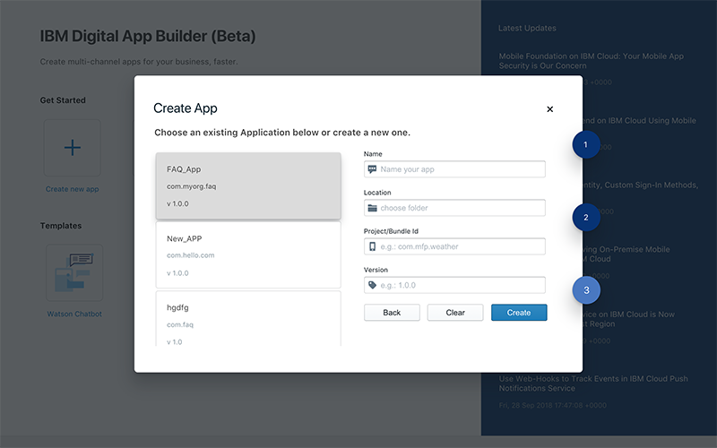

    Click **Create** to create the application. This displays the **Project Explorer** window. This is your workspace for creating a new application.

    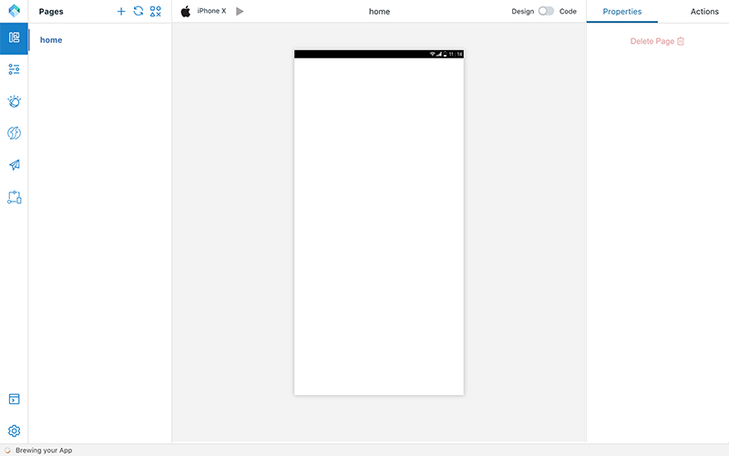

 
# Developing an Application

## About the Explorer

 

Project Explorer consists of the following section:

* **Activity Bar** – Consists of:
    * **Workbench** - displays or hides page details
    * **Data** - helps you to add a dataset by connecting to an existing data source or create a data source for a microservice using OpenAPI doc. 
    * **Watson** - consists of Image Recognition and Chatbot (Watson Assistant) components for configuring an existing instance or create a new instance. 
    * **Cloud Functions** - helps you to work with Cloud Functions (Coming soon!)
    * **Engagement** - work with Engagements (Coming soon!)
    * **DevOps** - work with IBM DevOps process (Coming soon!)
    * **Page** consists of the pages of the application and **Controls**. You can create new pages by clicking the **+** sign.
    * **Project Editor**: displays the project files location and files can be viewed in code.

        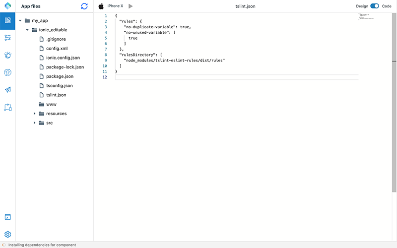 

    * **Console**: displays the console to see the code for each component.
    * **Settings**: displays the project details.

        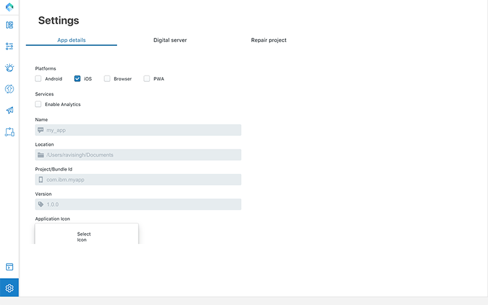

        You can make modifications to the app settings. You can select additional platform, adding **Application Icon** in the **App details** tab. 

        In the **Digital server** tab, you can modify the server details, if required. 

        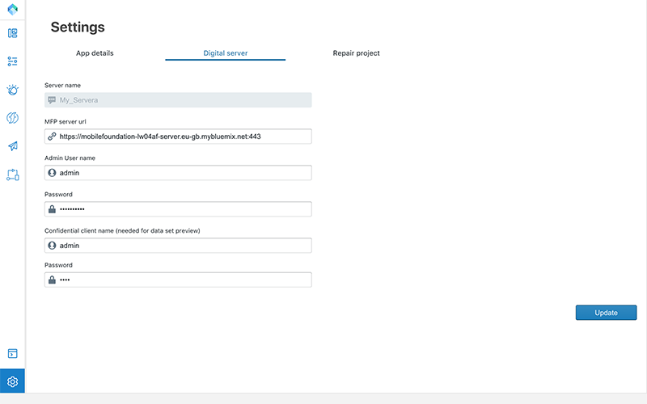

        **Repair project** tab enables you to rebuild the app.

        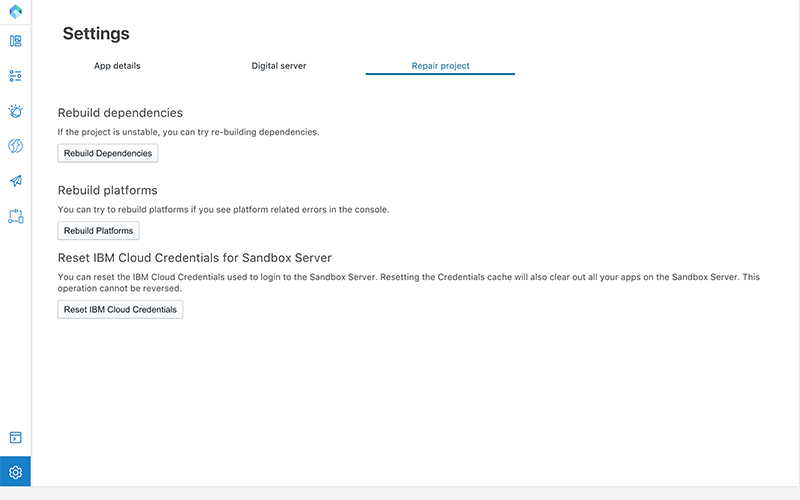


* **Canvas** – At the centre of the project explorer is the canvas which displays the either the design or the code and the channel for which the app creation is planned.
* **Properties** – At the right-hand side is the properties and action toolbar. When a control is placed in the canvas, you can edit and modify the properties of the control and connect a control with a related action to perform.


# Controls

**Controls** adds functionality to a page in an app. You can drag and drop the controls from the Controls pallette to a page. Each control has a set of properties and actions.

## Basic controls

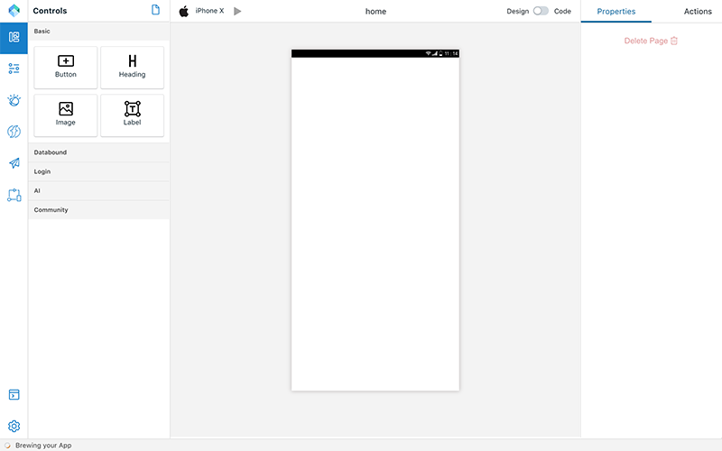

### Button

Buttons has a property of label. In the Action tab you can specify the page to navigate to on click of the Button.

### Heading Text

Helps you to add a heading text for the application such as Page Title.

### Image

Helps you upload a local image or provide a url of an image.

### Label

Helps you to add static text to your page body.

## Databound

**Databound** Controls help you to connect with a data set and operate on the entities in the data set.

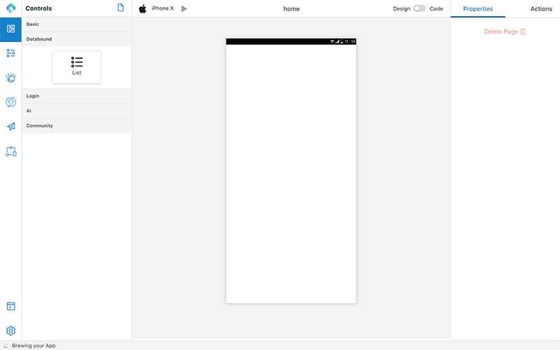

### Basic List

This control allows you to list the items, modify them, create them and delete them.

1. In the **Properties** tab, select the **Dataset** which you want to associate with the Basic List control.
2. Select the Actions and Attributes that you want to associate with item list / Create/ Update/ Delete.

Now your component is associated with the dataset. This will allow your app to list, edit, create and delete the entities from the backend microservice.


## Login

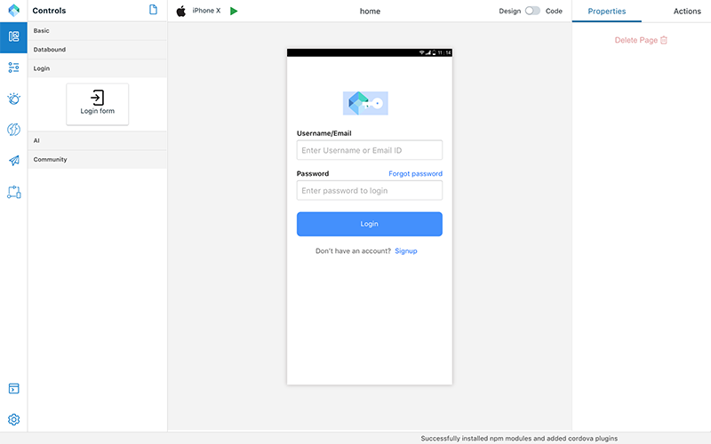

### Login Form

The Login Form control helps you to create a login page for your application to connect the user to the Mobile Foundation server. Mobile Foundation server provides a security framework to authenticate users and provide that security context to access the data sets. For more information read [here](https://mobilefirstplatform.ibmcloud.com/tutorials/en/foundation/8.0/authentication-and-security/creating-a-security-check/).

1. Make the following changes on Mobile Foundation Server
    * Deploy a security check adapter which would take username and password as input. You can use the sample adapter from [here](https://github.com/MobileFirst-Platform-Developer-Center/SecurityCheckAdapters/tree/release80).
    * In the mfpconsole, go to app's security tab and under Mandatory Application Scope, add the above created security definition as scope element.
2.	Make the following configuration in your Application using the Builder.
    * Add **Login Form** control to a page in the canvas.
    * In **Properties** tab, provide the **Security check name** and the page to navigate **On Login Success**.
    * Run the app.
 

## AI

 **AI** controls allow you to add AI based capabilities to your app.

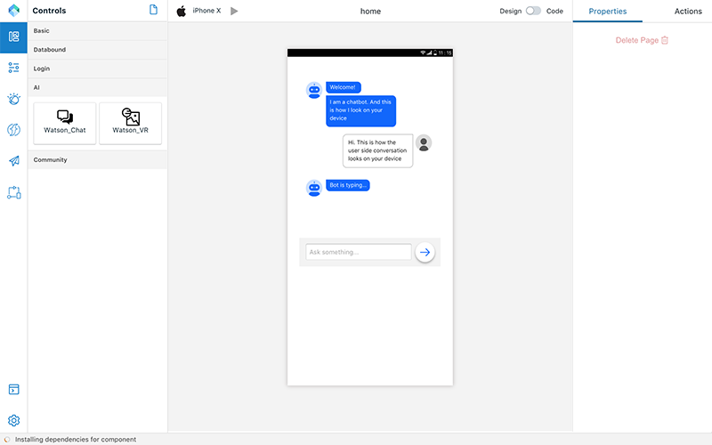

### Watson Chat
This control provides a complete chat interface that can be powered with Watson Assistant service on IBM Cloud. In the properties section select the configured Watson Assistant service and select the Workspace you want to connect to. To define and train a Chat conversation see <hhere>

### Watson VR
This control provides a ability to take a picture and have Watson Visual recognition service identify it for you.
In the properties section select the configured Visual Recognition service and the classification model. To define and train using your own images see <here>  


# Using Data viewer

## Dataset Creation

Creating a Data set for a micro service involves the following steps. After creating the data set, you can connect the data bound controls in your app.

### Creating a new data set

1. From the landing page of the Builder, open any existing App or create one.
2. Click **Data** tab.
3. Create a data set. You can either create from an existing source (default) or create a data source for a microservice using an OpenAPI doc.
    * Create from existing data source (default) - This will populate the dropdown with all the Data sources (adapters) from the configured Mobile Foundation server.
    * Create Data source for a microservice using OpenAPI doc - This option lets you create a Data Source from an Open API specification document (Swagger json/yml) file, and a Data Set from it.

### Create a Data set from an existing Data Source

1. Select the Datasource for which you want to create the Dataset.
2. This will populate the available entities in the Data Source. Select the entity to be created.
3. Give a name to the dataset and click on **Add** button.
4. This will add the Dataset and you will be able to see the Attributes and Actions associated with that dataset.
5. You can Hide some of the attributes and Actions based on what you want to do with the data set.
6. You can also edit the **Display Labels** for the attributes
7. You can also Test any of the GET Actions by providing the required attributes and clicking on the **Run this action** which is part of the Action. Remember for this to work you should have specified the Confidential client name and password in the settings tab.

### Create a Data source for a Microservice using a swagger file

1. Select the **json/yml** file for which you want to create a datasource for and click **Generate**.
2. This will generate an Adapter, which is a configuration artifact on the MF server that you can re-use and deploy it to the Mobile Foundation server.
3. Select the entity for which you want to define the data source for.
4. Give a name to the dataset and click on **Add** button.
5. This will add the Dataset and you will be able to see the Attributes and Actions associated with that dataset.

You can now bind this data set to any of the [data bound controls](#databound).


# Integrating with Watson Services

The builder provides a ability to configure the connections to connect to the various Watson services provisioned on IBM Cloud.

## Chatbot

Chatbots are powered by Watson Assistant service on IBM Cloud. Create a Watson Assistant instance on IBM Cloud. For more information, see [here](https://cloud.ibm.com/catalog/services/watson-assistant-formerly-conversation).

Once configured you can create a new **Workspace**. The workspace is a set of conversations that make up a chatbot. After creating a Workspace, start creating the dialogs. Provide a set of questions for a intent and a set of answers for that intent. Watson Assistant uses Natural Language Understand to interpret the intent based on the sample questions you provided. It can then try to interpret the question that a user asks in various styles and map it to the intent.

## Image Recognition 

Image recognition capability is powered by Watson Visual recognition service on IBM Cloud. Create a Watson Visual Recognition instance on IBM Cloud. For more information, see [here](https://cloud.ibm.com/catalog/services/visual-recognition).

Once configured, you can now create a new Mobel and add classes to it. You can drag and drop images in to the Builder and then train your Model on those images. Once the training is complete, you can either download the CoreML model or use the Model in a AI control in your app.


# Using Code Editor

Code editor helps you to edit the code and enable to view and debug any errors.

In the canvas, switch from **Design to Code**, to view the code of the specific file in the project editor.

1. Switching the **Design to Code** will display the following popup screen:

    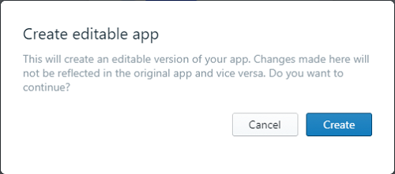
 
2. Click **Create** will create a copy of your application in an editable form. Any changes made in your app will not be reflected in the original application.
3. This will display the project explorer with all the project files for the application.

# Preview using the Builder

You can preview the application developed by connecting to the simulation to the channel selected.

* To preview the App on iOS, download and install **XCode** from Apple App Store.
* To preview the App on Android, 
    * Install Android Studio and follow the instruction. [https://developer.android.com/studio/](https://developer.android.com/studio/)
    * Configure an Android Virtual Machine. Follow the instructions [here](https://developer.android.com/studio/releases/emulator).

# Deploying an Application

After previewing your application and if it is ready for deploying, after rectifying any errors, perform the following steps for deploying the application:

**For Android application:**

1. Navigate to the directory, which you have specified at the time of creating the application.
2. Go to ionic folder.
3. Go to **Platform > Android**.
4. Open Android Studio and then go to **File > Open Project** > Choose the android folder mentioned in step 3.
5. Build the project. 
    >**Note**: For publishing and building follow the steps from tutorial https://developer.android.com/studio/publish/.

**For iOS application**:

1. Navigate to the directory, which you have specified at the time of creating the application.
2. Go to ionic folder.
3. Go to Platform > iOS.
4. Open **Xcode** and then build the project. 
    >**Note**: For publishing and building follow the steps from tutorial https://developer.apple.com/ios/submit/.

# Troubleshooting

* In case of any error, refer to the `log.log` file for the respective platform folder path below:
    * On mac OS: `~/Library/Logs/<app name>/log.log`.
    * On Windows: `%USERPROFILE%\AppData\Roaming\<app name>\log.log`.

* Failure to create a Data set for a Microservice using a swagger file.

    For the first time users of the Builder, the microservice creation may fail due to network letency.
    To get rid of this, follow these steps:
    1. Open command prompt and go to the installed location of the app.
    2. `cd ibm\adapterGenerator`
    3. Run the following command
        `windows> execute.bat .`
        `mac>./execute.sh .`
    4. on successful complication of the above command, you can start using microservice (swagger file) from the Builder.

* Failure to preview the application on Windows.

    In the Builder, go to **Settings > Repair project** and click **Rebuild Dependencies** and **Rebuild Platforms** buttons.

* In MacOS, preview of the application on an Android simulator fails with app crashes. With the following error:

    `java.lang.RuntimeException: Unable to create application com.ibm.MFPApplication: java.lang.RuntimeException: Client configuration file mfpclient.properties not found in application assets. Use the MFP CLI command 'mfpdev app register' to create the file.`

    To resolve this, from the terminal navigate to the app ionic directory and run the following commands:

    `ionic cordova plugin remove cordova-plugin-mfp
    ionic cordova plugin add cordova-plugin-mfp`

    and preview from the Builder again.
    
# FAQ
	
* How to create a **Platform API Keys**

    1. Go to [https://cloud.ibm.com/iam/#/apikeys](https://cloud.ibm.com/iam/#/apikeys) after login to IBM Cloud.
    2. Navigate to **Users**, click your name from the list and select the **User details** option.
    3. Click **Create an IBM Cloud API key** window.
    3. Enter the **Name** and **Description** for the new API Key.
    4. Click **Create**.
    4. Then, click **Show** to display the API key to copy and save it for later, or click **Download**.

    >**Note**: For security reasons, the API key is only available to be copied or downloaded at the time of creation. If the API key is lost, you must create a new API key. For more information on user API Key, refer to [https://cloud.ibm.com/docs/iam/userid_keys.html#userapikey](https://cloud.ibm.com/docs/iam/userid_keys.html#userapikey).

# Known Issues

* Cannot preview an app on Windows

    Run the Digital App Builder on Windows with Administrative privileges. You can do this by selecting the Builder icon and right-click and select "Run as administrator". 

* Builder crashes when you create a page name with a number.

    Do not use numbers in a page name.
