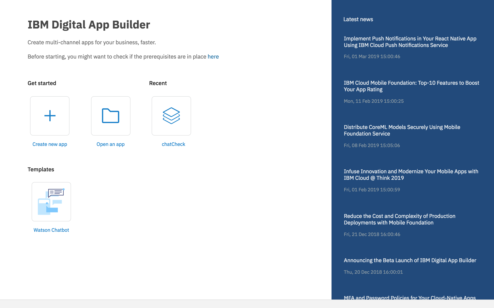
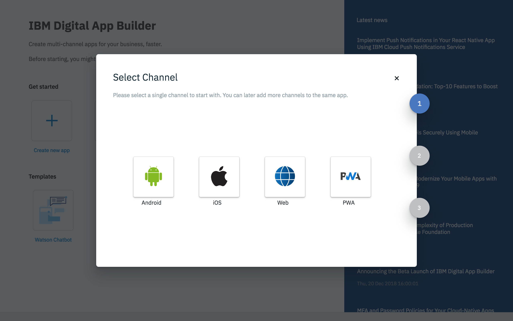
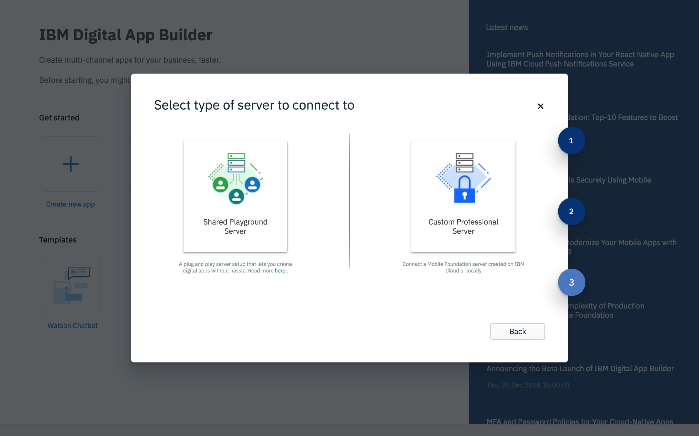
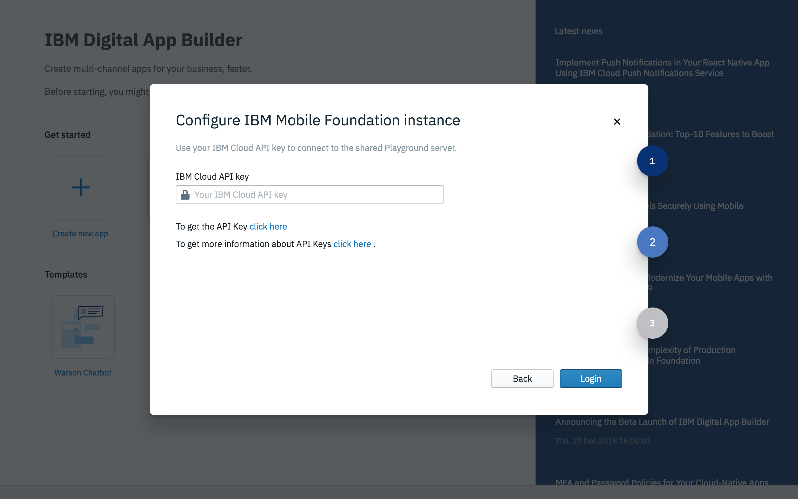
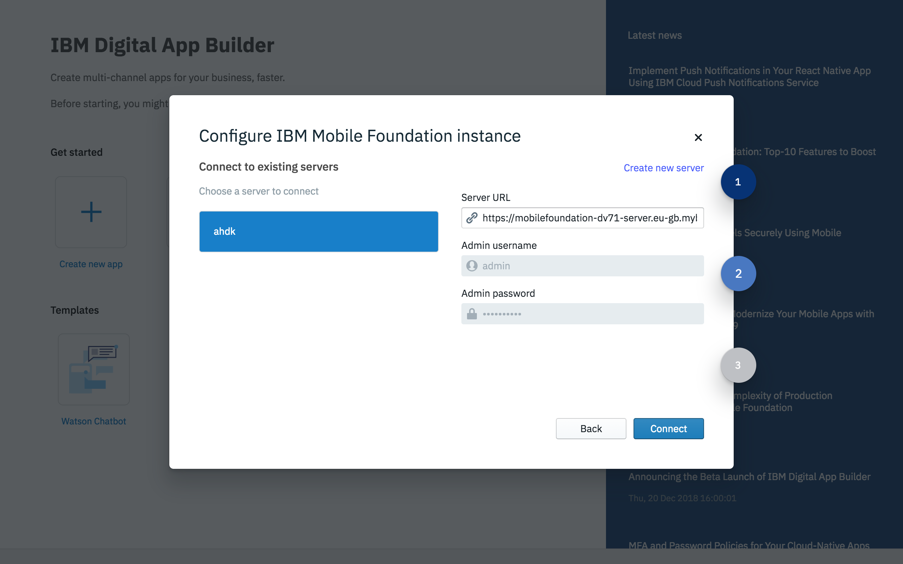
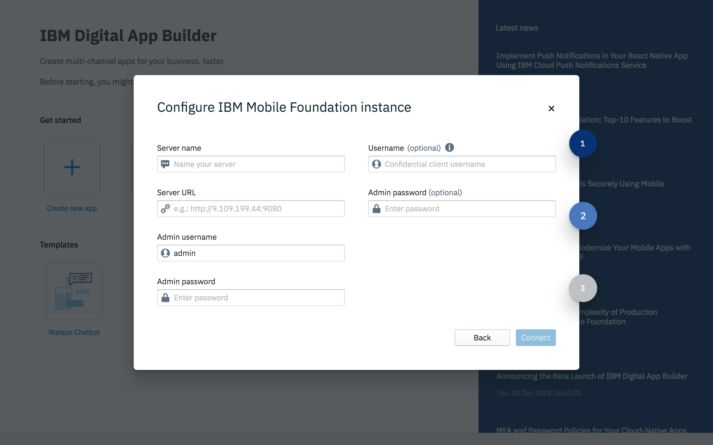
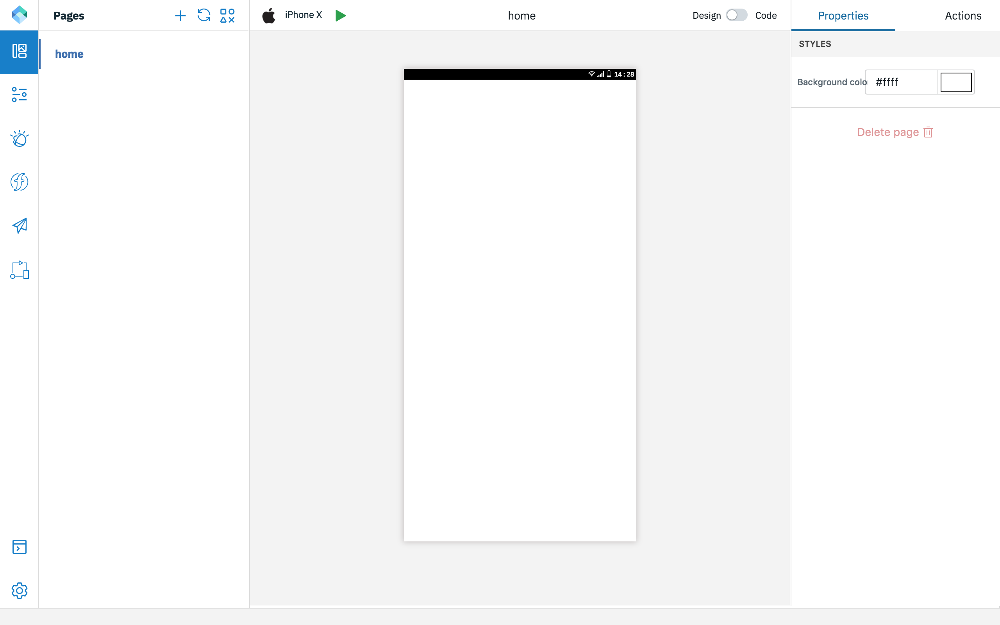

<!-- NLS_CHARSET=UTF-8 -->
# Getting Started
{: #getting-started }

You can launch the Digital App Builder from:

* In **MacOS**, double click the **IBM Digital App Builder icon** to open the Digital App Builder.
* In **Windows**, launch the Digital App Builder by selecting **Start > Programs > IBM Digital App Builder**.

>**Note**: If you are opening the Digital App Builder for the first time, **Accept** the **License to use IBM Digital App Builder** in the flash screen to proceed further. After accepting the license agreement, the **Prerequisites Check** runs automatically for the first time. Click **OK** to proceed, if no errors found otherwise fix the errors and then restart the Digital App Builder.

You can **Create new app** or **Open an app** or use the available Templates to further build your app.
>**Note**: You can see your recently created app under **Recent** section. For new installation, you will not be seeing the **Recent** section.

## Create new app
{: #create-new-app }

You can create a new app by clicking **Create new app** icon from the Builder dashboard.

1. Click **Create new app** icon. This will display the **Select Channel** window.

    

2. Select the channel for which you want to develop the app, by clicking the respective icon. You can later add more channels to the same app.

    * **Android**: Select this option if you are creating an android app.
    * **iOS**: Select this option if you are creating an iOS app.
        >**Note**: You can build and run the iOS apps only on MacOS.
    * **Web**: Select this option if you are creating the app for the Web.
    * **PWA**: Select this option if you are creating a Progressive Web App.

3. The **Select type of server to connect to** window is displayed.

    

4. You can select a **Shared Playground Server** or a **Custom Professional Server**.

    * **Shared Playground Server** – a shared Mobile Foundation server hosted on IBM Cloud to get you started quickly.

        >**Warning**: The Shared Playground Server is a common server that is shared between many developers. This server should not be used for production apps. The data in this server can be deleted without notice. The server uptime is not guaranteed.

        

        * Enter the **IBM Cloud API Key**. For more details access details refer to [**How to create a Platform API Keys**](/faq/) in the FAQ section. 

        * Click **Login** to connect to the server. 

    * **Custom Professional Server** – You can connect to your own Mobile Foundation server either created on IBM Cloud or local. In the **Configure IBM Mobile Foundation instance** window you can either select an existing server or create a new server.

        
 
        The **Configure IBM Mobile Foundation instance** window displays the list of Mobile Foundation server instances you have defined previously. On selecting the server, the **Server name**, **Server URL**, **Admin username**, **Admin password**, is displayed. To define a new server, you can click **Create new server** link. This will display the new **Configure IBM Mobile Foundation instance** window.

        

        * Enter the new IBM Mobile Foundation instance details, like **Server name**, **Server URL**, **Admin username**, **Admin password**.
            >**Note**: You can get the server url and login credentials from the Mobile Foundation server dashboard for the selected server instance.
        * Optionally, provide a **Username** (Confidential client username) and **Admin password**, for previewing the data in the Data viewer.
        * Click **Connect**.

5. On successful login/connect, the **Create App** window is displayed where you can select an existing app definition that you may have created or create a new one by entering the details. 
    * For a new app provide: **Name** of the application, **Location** where the project files will be stored, **Project/Bundle Id**, and **Version** of the application. 
 
        

    * Click **Create** to create the application. This displays the **Welcome to Workbench** window.
    * Click **Let's Start**. This opens the Digital App Builder workspace for creating a new application/modifying an existing application.

        

## Open an existing app
{: #open-an-existing-app }
 
>**Note**: You can open an existing app developed using the Digital App Builder only.

You can open an existing app in one of the following ways:

* Click **Open an app** from the home page opens the file explorer. Navigate to your app project folder and click **OK** to open the app for further edits.
* Optionally you can open the app from the Recent app list, if listed, by double clicking the app name.

## Using templates
{: #using-templates }

You can use templates to quickly build your application. These are specific feature enabled app templates that will help you to quickly modify and develop the app. Only Watson chatbot available as of now.

