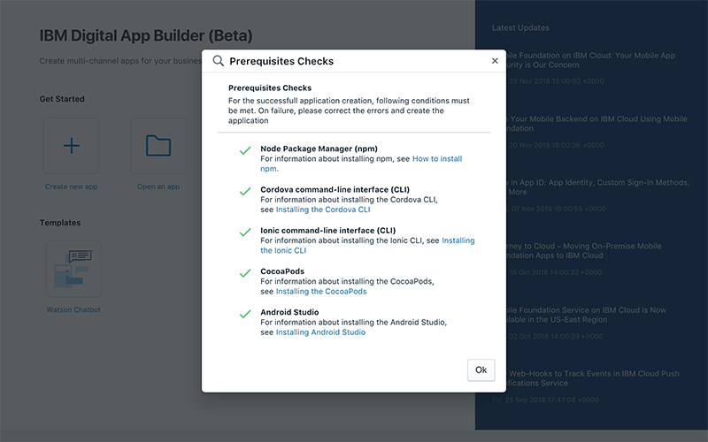

<!-- NLS_CHARSET=UTF-8 -->
# Installation and Configuration
{: #installation-and-configuration }

You can install the Digital App Builder on MacOS and Windows platform.

## Installing on MacOS
{: #installing-on-macos }

1. Install **Node.js** and **npm** by downloading the setup from [https://nodejs.org/en/download](https://nodejs.org/en/download) (Node.js 8.x or above). For more information on installation instructions, refer [here](https://nodejs.org/en/download/package-manager/). Check the node and npm version as shown below: 
    ```java
    $node -v
    v8.10.0
    $npm -v
    6.4.1
    ```
2. Install **Cordova**. You can download and install the package from [Cordova](https://cordova.apache.org/docs/en/latest/guide/cli/index.html).
    ```java
    $ npm install -g cordova
    $ cordova –version
    7.0.1
    ```

    >**Note**: If you are facing any permission issues in running `$ npm install -g cordova` command, install using elevated previleges (`$ sudo npm install -g cordova`).

3. Install **ionic**. You can download and install the package from [ionic](https://ionicframework.com/docs/cli/).
    ```java
    $ npm install -g ionic
    $ ionic –version
    4.2.0
    ```

    >**Note**: If you are facing any permission issues in running `$ npm install -g ionic` command, install using elevated previleges (`$ sudo npm install -g ionic`).

4. Download the .dmg (**IBM.Digital.App.Builder-n.nn.n.dmg**) from [here](https://github.com/MobileFirst-Platform-Developer-Center/Digital-App-Builder/releases) or from [IBM passport advantage](https://www.ibm.com/software/passportadvantage/???).
5. Double click on .dmg file to mount the installer.
6. In the window that the installer opens, drag and drop the IBM Digital App Builder to the **Applications** folder.
7. Double click the IBM Digital App Builder icon or executable to open the Digital App Builder.
>**Note**: When the Digital App Builder is installed for the first time, the Digital App Builder opens up the interface and performs a [Prerequisites Check](#prerequisites-check). In case of any error, rectify the error and restart the Digital App Builder before creating an application.

## Installing on Windows
{: #installing-on-windows }

Run the following commands from the command prompt opened in administrative mode:

1. Install **Node.js** and **npm** by downloading the setup from [https://nodejs.org/en/download](https://nodejs.org/en/download) (Node.js 8.x or above). For more information on installation instructions, refer [here](https://nodejs.org/en/download/package-manager/). Check the node and npm version as shown below: 

    ```java
    C:\>node -v
    v8.10.0
    C:\>npm -v
    6.4.1
    ```

2. Install **Cordova**. You can download and install the package from [Cordova](https://cordova.apache.org/docs/en/latest/guide/cli/index.html).

    ```java
    C:\>npm install -g cordova
    C:\>cordova –v
    7.0.1
    ```

3. Install **ionic**. You can download and install the package from [ionic](https://ionicframework.com/docs/cli/).

    ```java
    C:\>npm install -g ionic
    C:\> ionic –version
    4.2.0
    ``` 

4. [Download](https://github.com/MobileFirst-Platform-Developer-Center/Digital-App-Builder/releases) the Digital App Builder installation file (**IBM.Digital.App.Builder.Setup.n.nn.n.exe**) or from [IBM passport advantage](https://www.ibm.com/software/passportadvantage/???).
5. Double click the Digital App Builder executable to install. A short cut is also created in the **Start > Programs** in the desktop. The default installation folder is `<AppData>\Local\IBMDigitalAppBuilder\app-n.nn.n`.
>**Note**: When the Digital App Builder is installed for the first time, the Digital App Builder opens up the interface and performs a [Prerequisites Check](#prerequisites-check). In case of any error, rectify the error and restart the Digital App Builder before creating an application.

## Prerequisites Check
{: #prerequisites-check }

You can perform a prerequisites check by selecting **Help > Prerequisites Check** before developing an app.



In case of any error, rectify the error and restart the Builder before creating an app.

>**Note**: [CocoaPods](https://guides.cocoapods.org/using/using-cocoapods) are required for MacOS only.

